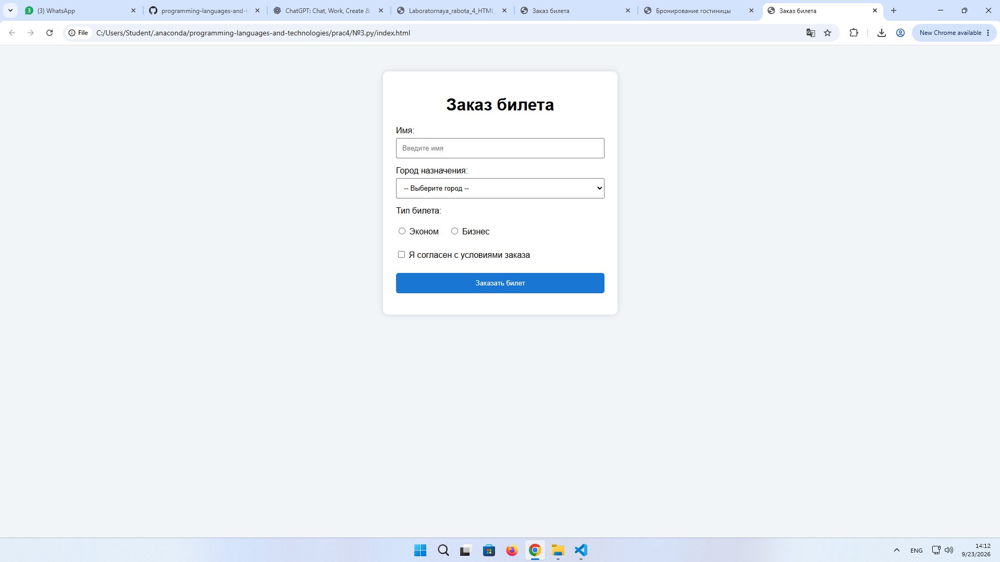
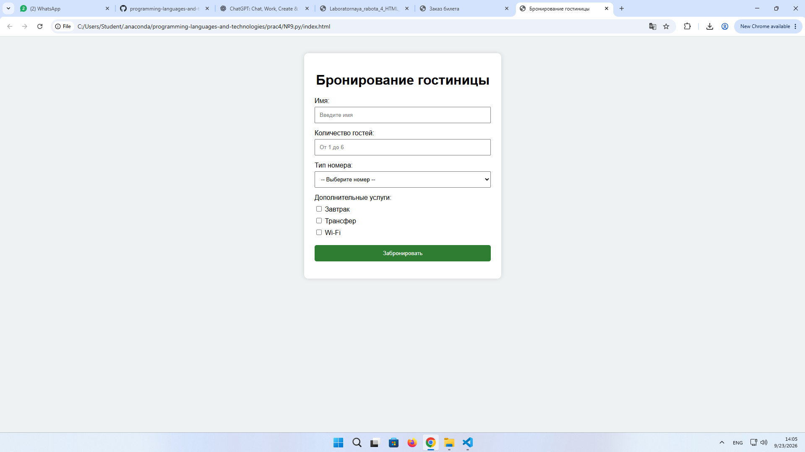
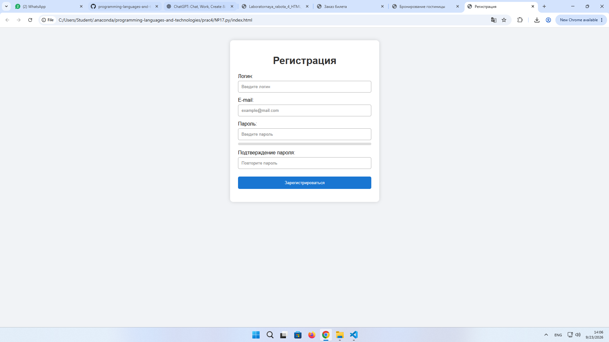

# ОТЧЁТ

 ## Лабораторная работа №4

 ### «Формы и валидация на стороне клиента (HTML + JavaScript)»

 **Дисциплина:** Языки и технологии программирования\
 **Тема:** Текстовые поля, checkbox, radio, select, простая валидация\
 **Выполненные варианты:** №3, №9, №17

---

 ## 1\. Тема и цель работы

 **Тема:** Создание HTML-форм и выполнение клиентской валидации с использованием JavaScript.

 **Цель работы:**\
 Научиться создавать HTML-формы с использованием элементов `input`, `select`, `checkbox`, `radio`, обрабатывать событие отправки формы, выполнять проверку введённых данных с помощью JavaScript и выводить пользователю сообщения об ошибках.

---

 ## 2\. Номер и условие вариантов

 ### Вариант №3

 **Форма заказа билета:** имя, город назначения (`select`), тип билета (`radio`), подтверждение согласия (`checkbox`). Проверить обязательные поля.

 ### Вариант №9

 **Форма бронирования гостиницы:** имя, количество гостей, тип номера, дополнительные услуги. Проверить диапазон количества гостей **1–6**.

 ### Вариант №17

 **Форма регистрации с индикатором сложности:** логин, e-mail, пароль, подтверждение. Проверять данные при вводе и при отправке формы.

---

 # 3\. Краткое описание элементов формы и правил валидации

 В работе использовались следующие HTML-элементы:

 - `<form>` — контейнер для элементов формы;
- `<input type="text">` — ввод имени или логина;
- `<input type="number">` — ввод количества гостей;
- `<input type="email">` — ввод электронной почты;
- `<input type="password">` — ввод пароля;
- `<input type="radio">` — выбор одного варианта;
- `<input type="checkbox">` — подтверждение или выбор нескольких вариантов;
- `<select>` — выбор значения из списка;
- `<button type="submit">` — отправка формы.

 Для обработки формы используется JavaScript.

 Основное событие:

```
form.addEventListener("submit", function(event) {
    event.preventDefault();
});
```

 Метод `preventDefault()` отменяет стандартную отправку формы и позволяет сначала выполнить проверку данных.

---

 # 4\. Исходный код HTML, CSS и JavaScript

 В работе были созданы три отдельных файла:

```
zadanie3.html
zadanie9.html
zadanie17.html
```

 Каждый вариант является самостоятельной HTML-страницей.

 ### Вариант №3

 Форма содержит:

 - поле имени;
- список городов;
- переключатели типа билета;
- checkbox согласия;
- кнопку отправки.

 JavaScript проверяет:

 1. Введено ли имя.
2. Выбран ли город.
3. Выбран ли тип билета.
4. Подтверждено ли согласие.

 После успешной проверки выводится сообщение:

 > Билет успешно заказан!

---

 ### Вариант №9

 Форма содержит:

 - имя;
- количество гостей;
- тип номера;
- дополнительные услуги;
- кнопку бронирования.

 JavaScript проверяет:

```
if (guests === "" || guests < 1 || guests > 6)
```

 Таким образом, количество гостей должно находиться в диапазоне от **1 до 6**.

 Также проверяется заполнение имени и выбор типа номера.

---

 ### Вариант №17

 Форма содержит:

 - логин;
- e-mail;
- пароль;
- подтверждение пароля;
- индикатор сложности пароля.

 Проверка происходит **непосредственно во время ввода**.

 Для e-mail используется регулярное выражение:

```
/^[^\s@]+@[^\s@]+\.[^\s@]+$/
```

 Сложность пароля определяется по нескольким условиям:

 - длина не менее 6 символов;
- наличие заглавной буквы;
- наличие цифры;
- наличие специального символа.

 Также проверяется совпадение пароля и его подтверждения.

---

 # 5\. Скриншоты формы



 ### Рисунок 2 — Форма бронирования гостиницы, вариант №9
  


 ### Рисунок 3 — Форма регистрации, вариант №17
  


---

 # 6\. Результаты тестирования

 ## Вариант №3

 | № | Тест | Результат |
| --- | --- | --- |
| 1 | Все поля заполнены правильно | Форма успешно отправлена |
| 2 | Имя не заполнено | Выводится ошибка |
| 3 | Город не выбран | Выводится ошибка |
| 4 | Тип билета не выбран | Выводится ошибка |
| 5 | Согласие не подтверждено | Выводится ошибка |

## Вариант №9

 | № | Тест | Результат |
| --- | --- | --- |
| 1 | 2 гостя, номер выбран | Бронирование успешно |
| 2 | Имя не заполнено | Выводится ошибка |
| 3 | Количество гостей = 0 | Выводится ошибка |
| 4 | Количество гостей = 7 | Выводится ошибка |
| 5 | Тип номера не выбран | Выводится ошибка |

## Вариант №17

 | № | Тест | Результат |
| --- | --- | --- |
| 1 | Корректные логин, e-mail и пароль | Регистрация успешна |
| 2 | Логин меньше 3 символов | Выводится ошибка |
| 3 | Неверный e-mail | Выводится ошибка |
| 4 | Пароль меньше 6 символов | Выводится ошибка |
| 5 | Пароли не совпадают | Выводится ошибка |

---

 # 7. Вывод

 В ходе лабораторной работы были созданы три HTML-формы для вариантов №3, №9 и №17.

 В процессе работы были изучены и применены элементы HTML-форм: `input`, `select`, `radio`, `checkbox` и `button`. С помощью JavaScript была реализована клиентская проверка введённых данных.

 Для формы заказа билета была выполнена проверка обязательных полей и выбора типа билета. Для формы гостиницы реализована проверка количества гостей в диапазоне от 1 до 6. Для формы регистрации реализованы проверка логина, e-mail, пароля, совпадения паролей и индикатор сложности пароля.

 Таким образом, поставленная цель лабораторной работы была достигнута.

---

 # 8\. Ответы на контрольные вопросы

 ## 17\. Что такое HTML-форма?

 **HTML-форма** — это элемент веб-страницы `<form>`, предназначенный для ввода пользователем данных и их последующей обработки или отправки.

 Пример:

```
<form>
    <input type="text">
    <button type="submit">Отправить</button>
</form>
```

---

 ## 18\. Для чего используются элементы input, select и button?

 `input` используется для ввода различных данных: текста, числа, пароля, e-mail, выбора checkbox и radio.

 `select` используется для выбора одного значения из выпадающего списка.

 `button` используется для создания кнопки, например кнопки отправки формы.

---

 ## 19\. Чем checkbox отличается от radio?

 **Checkbox** позволяет выбрать **несколько вариантов** одновременно.

 Например:

```
<input type="checkbox"> Завтрак
<input type="checkbox"> Wi-Fi
<input type="checkbox"> Трансфер
```

 **Radio** используется для выбора **одного варианта из группы**.

 Например:

```
<input type="radio" name="ticket"> Эконом
<input type="radio" name="ticket"> Бизнес
```

 У radio одной группы должно быть одинаковое значение `name`.

---

 ## 20\. Что такое клиентская валидация?

 **Клиентская валидация** — это проверка введённых пользователем данных непосредственно в браузере до отправки формы на сервер.

 Например, можно проверить:

 - заполнено ли поле;
- правильный ли формат e-mail;
- длину пароля;
- диапазон числа;
- совпадение двух полей.

---

 ## 21\. Для чего используется событие submit?

 Событие `submit` возникает при попытке отправить HTML-форму.

 Его можно обработать в JavaScript:

```
form.addEventListener("submit", function(event) {
    // проверка формы
});
```

 Это позволяет проверить данные перед отправкой.

---

 ## 22\. Что делает event.preventDefault()?

 `event.preventDefault()` отменяет стандартное действие браузера.

 При отправке формы он предотвращает стандартную отправку и перезагрузку страницы.

 Например:

```
form.addEventListener("submit", function(event) {
    event.preventDefault();
});
```

 После этого JavaScript может самостоятельно проверить форму и вывести результат.

---

 ## 23\. Как получить значение текстового поля в JavaScript?

 С помощью свойства `.value`.

 Например:

```
const name = document.getElementById("name").value;
```

 Для удаления пробелов в начале и конце можно использовать:

```
const name = document.getElementById("name").value.trim();
```

---

 ## 24\. Как проверить состояние checkbox?

 Используется свойство `.checked`.

 Например:

```
const agree = document.getElementById("agree").checked;
```

 Если checkbox отмечен, значение будет `true`, если не отмечен — `false`.

---

 ## 25\. Как получить выбранное значение select?

 С помощью свойства `.value`.

 Например:

```
const city = document.getElementById("city").value;
```

 Полученное значение будет соответствовать выбранной опции.

---

 ## 26\. Почему клиентская валидация не заменяет серверную?

 Клиентскую проверку можно обойти или отключить, поэтому она не обеспечивает полную безопасность данных.

 Например, пользователь может изменить HTML или JavaScript в браузере.

 Поэтому сервер должен самостоятельно проверять полученные данные перед их обработкой или сохранением.

 **Клиентская валидация** прежде всего улучшает удобство использования формы, а **серверная валидация** необходима для надёжной проверки данных.

---

 ## 27\. Как сделать сообщение об ошибке понятным пользователю?

 Сообщение должно:

 - конкретно указывать на ошибку;
- быть коротким и понятным;
- объяснять, что нужно исправить;
- отображаться рядом с соответствующим полем или в понятном месте.

 Например, вместо:

 > Ошибка!

 лучше написать:

 > Пароль должен содержать минимум 6 символов.

---

 ## 28\. Какие тестовые случаи следует проверить для формы?

 Необходимо проверить как правильные, так и неправильные варианты ввода.

 Например:

 1. Все поля заполнены правильно.
2. Обязательное поле оставлено пустым.
3. Введено слишком короткое значение.
4. Введено значение неправильного формата.
5. Выбрано недопустимое значение.
6. Для числового поля введено значение меньше минимального.
7. Для числового поля введено значение больше максимального.
8. Не выбран обязательный `radio`.
9. Не отмечен обязательный `checkbox`.
10. Пароли введены по-разному.

 Для выполненных вариантов это соответствует проверкам имени, города, типа билета, количества гостей, e-mail, пароля и подтверждения пароля.