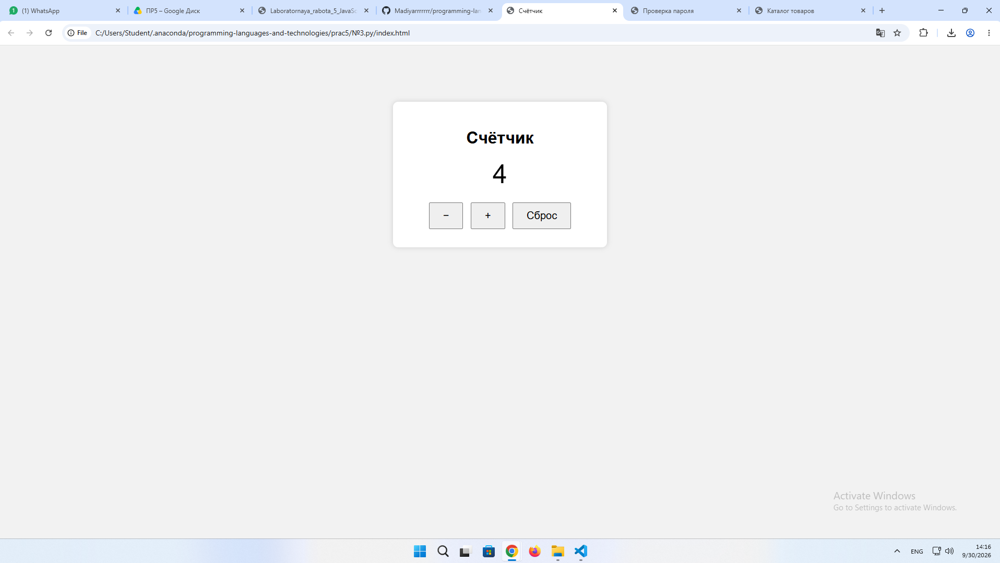
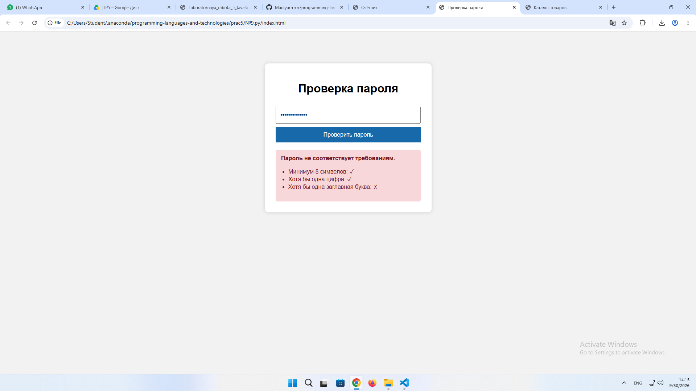
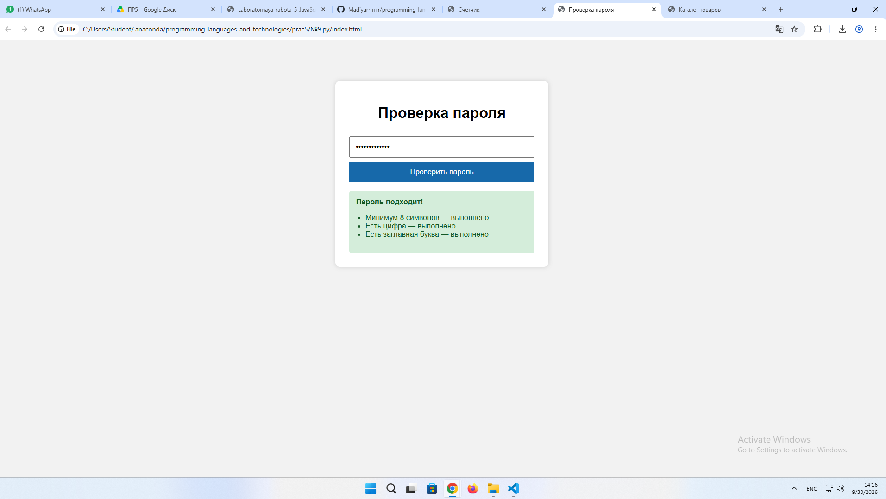
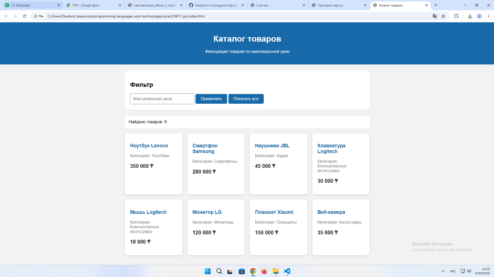

ЛАБОРАТОРНАЯ РАБОТА №5
Выполнил: Жантлеуов Мадияр / ИС 25 22

🧭 СЛАЙД 1: Введение и цели
🎯 Цель работы
Освоить основы JavaScript в браузере: работу с переменными, условиями, циклами, функциями, DOM-элементами и событиями. Научиться создавать интерактивные веб-страницы и изменять их содержимое с помощью JavaScript.

🛠 Стек технологий
Язык: JavaScript
Среда: Visual Studio Code / браузер
Технологии: HTML5, CSS3, JavaScript, DOM
Используемые возможности: let/const, if/else, циклы, функции, addEventListener(), querySelector(), classList

🔢 СЛАЙД 2: Задание №3 — Счетчик
Условие
Создать счетчик с тремя кнопками: «+», «−» и «Сброс». Текущее значение счетчика должно отображаться на странице и изменяться без перезагрузки.

🔍 Разбор задания
Для хранения текущего значения используется переменная:

let count = 0;

При нажатии кнопки «+» значение увеличивается на единицу:

count++;

При нажатии кнопки «−» значение уменьшается:

count--;

Кнопка «Сброс» возвращает значение к нулю:

count = 0;

Для изменения значения на странице используется DOM:

value.textContent = count;

Фрагмент кода:
let count = 0;

const value = document.querySelector("#value");
const plus = document.querySelector("#plus");
const minus = document.querySelector("#minus");
const reset = document.querySelector("#reset");

function updateCounter() {
    value.textContent = count;
}

plus.addEventListener("click", () => {
    count++;
    updateCounter();
});

minus.addEventListener("click", () => {
    count--;
    updateCounter();
});

reset.addEventListener("click", () => {
    count = 0;
    updateCounter();
});

🖥️ Демонстрация работы — Тест 1
► Начальное значение: 0

► Нажатие «+» → 1
► Нажатие «+» → 2
► Нажатие «+» → 3
► Нажатие «−» → 2
► Нажатие «Сброс» → 0

Результат
Счетчик корректно изменяет значение при нажатии кнопок, а кнопка сброса возвращает его к начальному состоянию.

🔐 СЛАЙД 3: Задание №9 — Проверка пароля
Условие
Создать проверку пароля. Необходимо отображать требования к паролю и сообщать пользователю, выполнены ли они: минимальная длина и наличие цифры.

🔍 Разбор задания
Введенный пользователем пароль получается из HTML-элемента:

const password = document.querySelector("#password").value;

Для проверки длины используется свойство:

password.length >= 8

Наличие цифры проверяется регулярным выражением:

/\d/.test(password)

После проверки сообщение выводится на страницу через textContent.

Фрагмент кода:
function checkPassword() {
    const password = document.querySelector("#password").value;
    const result = document.querySelector("#result");

    const lengthOk = password.length >= 8;
    const digitOk = /\d/.test(password);

    if (lengthOk && digitOk) {
        result.textContent = "Пароль соответствует требованиям";
        result.style.color = "green";
    } else {
        result.textContent =
            "Пароль должен содержать минимум 8 символов и хотя бы одну цифру";
        result.style.color = "red";
    }
}

document.querySelector("#check")
    .addEventListener("click", checkPassword);

🖥️ Демонстрация работы — Тест 2
Тест 1:

► Ввод: 12345

❌ Результат: пароль не соответствует требованиям.

Тест 2:

► Ввод: Mad12345

✔ Результат: пароль соответствует требованиям.

Результат
Программа проверяет длину пароля и наличие цифры, после чего динамически выводит соответствующее сообщение пользователю.
 
🛒 СЛАЙД 4: Задание №17 — Каталог товаров
Условие
Создать каталог товаров из массива объектов. Вывести карточки товаров на страницу с помощью цикла и добавить фильтр по максимальной цене.

🔍 Разбор задания
Товары хранятся в массиве объектов:

const products = [
    { name: "Ноутбук", price: 350000 },
    { name: "Смартфон", price: 180000 },
    { name: "Наушники", price: 45000 },
    { name: "Мышь", price: 15000 }
];

Для вывода товаров используется цикл:

products.forEach(product => {
    // создание карточки
});

Фильтрация осуществляется по цене:

products.filter(product => product.price <= maxPrice);

Фрагмент кода:
function showProducts(list) {
    const catalog = document.querySelector("#catalog");
    catalog.innerHTML = "";

    list.forEach(product => {
        const card = document.createElement("div");

        card.textContent =
            `${product.name} — ${product.price} тг`;

        catalog.appendChild(card);
    });
}

function filterProducts() {
    const maxPrice =
        Number(document.querySelector("#maxPrice").value);

    const filtered = products.filter(
        product => product.price <= maxPrice
    );

    showProducts(filtered);
}

document.querySelector("#filter")
    .addEventListener("click", filterProducts);

showProducts(products);

🖥️ Демонстрация работы — Тест 3
Исходный каталог:

Товар	Цена
Ноутбук	350 000 тг
Смартфон	180 000 тг
Наушники	45 000 тг
Мышь	15 000 тг

► Максимальная цена: 50 000 тг

✔ Результат:

Наушники — 45 000 тг

Мышь — 15 000 тг

Результат
Каталог формируется динамически из массива объектов. Фильтр позволяет отображать только товары, цена которых не превышает указанное пользователем значение.

📊 СЛАЙД 5: Сводная таблица тестов
Слайд / Задача	Входные данные	Ожидаемый результат	Статус
№3 — Счетчик	0, кнопки +, −, Сброс	Изменение значения счетчика	PASS
№9 — Проверка пароля	Mad12345	Пароль соответствует требованиям	PASS
№17 — Каталог товаров	Максимальная цена: 50 000	Вывод товаров до 50 000 тг	PASS

Дополнительная проверка задания №3
Начальное значение: 0

После трех нажатий «+»: 3

После одного нажатия «−»: 2

После нажатия «Сброс»: 0

Результат соответствует алгоритму работы счетчика.

Дополнительная проверка задания №9
Пароль 12345:

❌ Длина меньше 8 символов, цифра присутствует.

Пароль Mad12345:

✔ Длина не менее 8 символов и присутствует цифра.

Дополнительная проверка задания №17
При фильтре 50 000 тг отображаются:

Наушники — 45 000 тг

Мышь — 15 000 тг

Товары с большей стоимостью скрываются.

🏁 СЛАЙД 6: Заключение и выводы
💡 Итоги работы
Работа с переменными:
Закреплены навыки использования let и const для хранения данных.

Условия:
В задании №9 использована конструкция if/else для проверки соответствия пароля заданным требованиям.

Циклы:
В задании №17 применен forEach() для перебора массива товаров и формирования карточек.

Работа с DOM:
Освоено получение HTML-элементов с помощью querySelector(), создание элементов через createElement() и изменение содержимого страницы.

События:
Использован addEventListener() для обработки нажатий кнопок.

Массивы объектов:
В задании №17 создан массив товаров, содержащий название и цену каждого товара.

Фильтрация:
С помощью метода filter() реализован отбор товаров по максимальной стоимости.

🏁 Общий вывод
В ходе лабораторной работы были закреплены основные возможности JavaScript в браузере: работа с переменными, условиями, циклами, функциями, массивами, DOM и событиями.

8. Контрольные вопросы
16. Для чего используется JavaScript в браузере?
JavaScript используется для создания интерактивных веб-страниц: обработки действий пользователя, изменения содержимого HTML, работы со стилями и взаимодействия с DOM.

17. Чем let отличается от const?
let используется для переменных, значение которых можно изменить. const используется для переменных, которым нельзя присвоить новое значение после создания.

18. Что такое условный оператор?
Условный оператор позволяет выполнить разные действия в зависимости от условия. Например:

if (age >= 18) {
    console.log("Совершеннолетний");
} else {
    console.log("Несовершеннолетний");
}

19. Какие есть циклы в JavaScript?
Основные циклы: for, while, do...while. Также для перебора массивов часто используются forEach(), for...of и другие методы.

20. Что такое функция и параметр функции?
Функция — это блок кода, который выполняет определённую задачу. Параметр — это значение, которое функция получает при вызове.

function greet(name) {
    return "Привет, " + name;
}

Здесь name является параметром.

21. Что такое DOM?
DOM (Document Object Model) — объектная модель HTML-документа, которая позволяет JavaScript получать, изменять, создавать и удалять элементы веб-страницы.

22. Как получить HTML-элемент в JavaScript?
Например, с помощью querySelector():

const button = document.querySelector("#button");

Также можно использовать getElementById():

const button = document.getElementById("button");

23. Чем textContent отличается от value?
textContent используется для получения или изменения текста HTML-элемента.
value используется для получения значения элементов формы, например <input>.

element.textContent = "Привет";
input.value = "Мадияр";

24. Что такое событие?
Событие — это действие, которое происходит на веб-странице, например нажатие кнопки, ввод текста, изменение поля или движение мыши.

25. Для чего используется addEventListener()?
addEventListener() используется для добавления обработчика события к HTML-элементу.

button.addEventListener("click", () => {
    alert("Кнопка нажата");
});

26. Как добавить или удалить CSS-класс через JavaScript?
Для этого используется свойство classList:

element.classList.add("active");
element.classList.remove("active");

Также можно проверить наличие класса:

element.classList.contains("active");

27. Как создать HTML-элемент средствами DOM?
С помощью document.createElement():

const div = document.createElement("div");
div.textContent = "Новый элемент";
document.body.appendChild(div);

28. Как перебрать массив с помощью цикла?
Например, с помощью for:

for (let i = 0; i < products.length; i++) {
    console.log(products[i]);
}

Или с помощью forEach():

products.forEach(product => {
    console.log(product);
});

29. Почему проверка пользовательского ввода важна?
Проверка необходима, чтобы программа корректно обрабатывала данные пользователя, не допускала некорректные значения и предотвращала ошибки при выполнении программы.

30. Как разделение HTML и JavaScript улучшает структуру проекта?
HTML отвечает за структуру страницы, CSS — за оформление, а JavaScript — за логику и интерактивность. Такое разделение делает код более понятным, удобным для изменения и обслуживания.