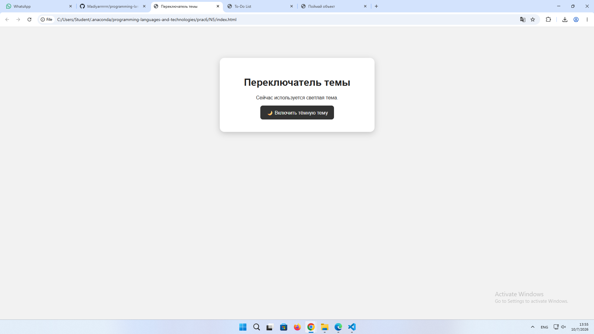
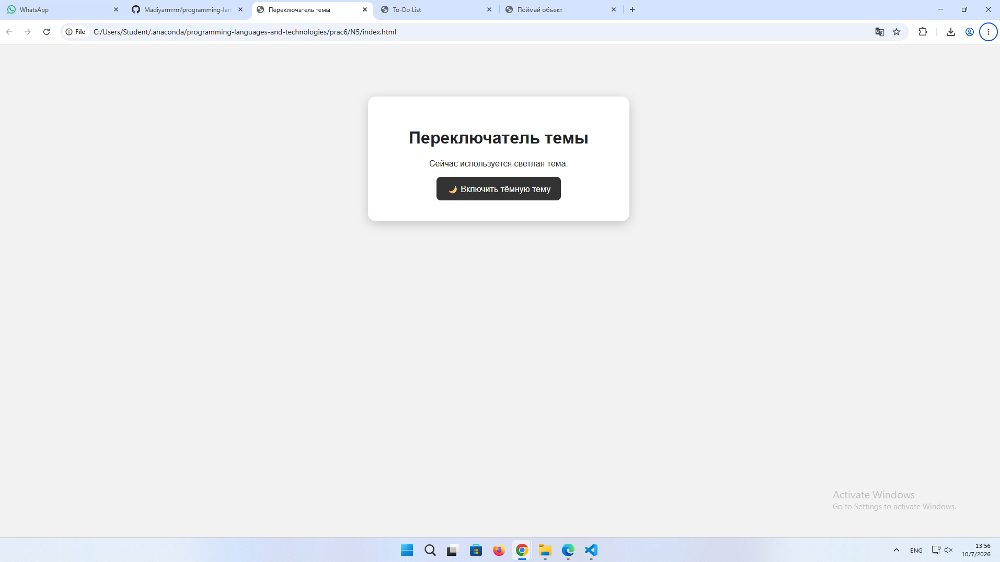
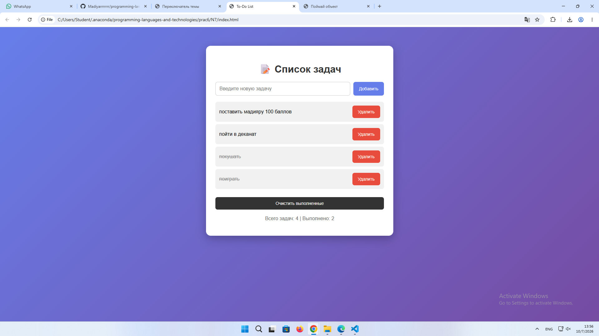
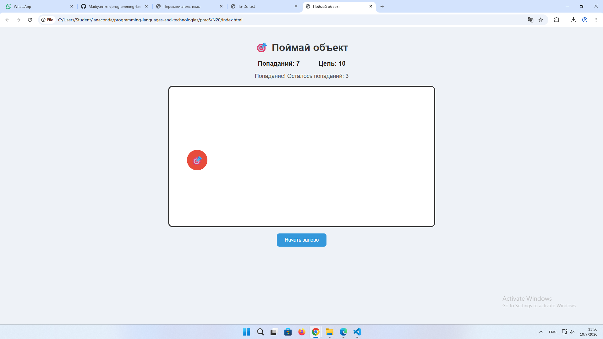
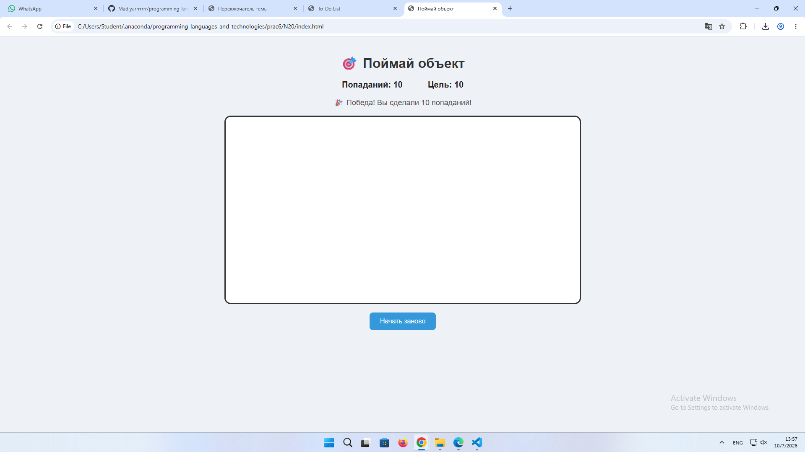

ЛАБОРАТОРНАЯ РАБОТА №6
Выполнил: Жантлеуов Мадияр / ИС 25 22

🧭 СЛАЙД 1: Введение и цели
🎯 Цель работы
Освоить практическое использование DOM и событий JavaScript для создания интерактивных веб-страниц. Научиться находить HTML-элементы, изменять их содержимое и CSS-классы, динамически создавать и удалять элементы, а также обрабатывать события мыши и клавиатуры.

🛠 Стек технологий
Язык: JavaScript
Среда: Visual Studio Code / браузер
Технологии: HTML5, CSS3, JavaScript, DOM
Используемые возможности: querySelector(), querySelectorAll(), createElement(), append(), remove(), addEventListener(), textContent, classList, обработка click и keydown.

🌙 СЛАЙД 2: Задание №5 — Переключатель светлой/тёмной темы
Условие
Создать переключатель светлой/тёмной темы страницы путём добавления и удаления CSS-класса.

🔍 Разбор задания
Для получения кнопки и текстового элемента используются методы DOM:

const themeBtn = document.querySelector("#themeBtn");
const text = document.querySelector("#text");

Для обработки нажатия кнопки используется событие click:

themeBtn.addEventListener("click", () => {
    // код
});

Переключение темы осуществляется с помощью classList.toggle():

document.body.classList.toggle("dark-theme");

Если тёмная тема включена, изменяется текст кнопки и описание:

themeBtn.textContent = "☀️ Включить светлую тему";
text.textContent = "Сейчас используется тёмная тема.";

Фрагмент кода
const themeBtn = document.querySelector("#themeBtn");
const text = document.querySelector("#text");

themeBtn.addEventListener("click", () => {

    document.body.classList.toggle("dark-theme");

    if (document.body.classList.contains("dark-theme")) {
        themeBtn.textContent = "☀️ Включить светлую тему";
        text.textContent = "Сейчас используется тёмная тема.";
    } else {
        themeBtn.textContent = "🌙 Включить тёмную тему";
        text.textContent = "Сейчас используется светлая тема.";
    }
});

🖥️ Демонстрация работы — Тест 1
Начальное состояние:

► Страница открывается в светлой теме.

Действие:

► Нажатие кнопки «🌙 Включить тёмную тему».

Результат:

✔ Фон страницы становится тёмным.
✔ Цвет текста изменяется.
✔ Цвет блока изменяется.
✔ Текст кнопки меняется на «☀️ Включить светлую тему».

Повторное нажатие:

► Тёмная тема отключается.

✔ Возвращается светлая тема.

Результат
Переключатель корректно изменяет оформление страницы с помощью добавления и удаления CSS-класса dark-theme. Изменение происходит без перезагрузки страницы.

📝 СЛАЙД 3: Задание №7 — To-Do List
Условие
Создать To-Do List с возможностью добавления задач, отметки выполнения, удаления отдельных задач и очистки всех выполненных задач.

🔍 Разбор задания
Для работы со списком получаются необходимые DOM-элементы:

const taskInput = document.querySelector("#taskInput");
const addBtn = document.querySelector("#addBtn");
const taskList = document.querySelector("#taskList");
const clearBtn = document.querySelector("#clearBtn");

При добавлении задачи создаётся новый элемент списка:

const li = document.createElement("li");

Также динамически создаются текст задачи и кнопка удаления:

const span = document.createElement("span");
const deleteBtn = document.createElement("button");

Затем элементы добавляются на страницу:

li.append(span, deleteBtn);
taskList.append(li);

Для отметки задачи выполненной используется classList.toggle():

li.classList.toggle("completed");

Для удаления задачи используется метод remove():

li.remove();

Фрагмент кода
function addTask() {

    const taskText = taskInput.value.trim();

    if (taskText === "") {
        alert("Введите текст задачи!");
        return;
    }

    const li = document.createElement("li");

    const span = document.createElement("span");
    span.textContent = taskText;
    span.classList.add("task-text");

    const deleteBtn = document.createElement("button");
    deleteBtn.textContent = "Удалить";
    deleteBtn.classList.add("delete-btn");

    span.addEventListener("click", () => {
        li.classList.toggle("completed");
        updateCounter();
    });

    deleteBtn.addEventListener("click", () => {
        li.remove();
        updateCounter();
    });

    li.append(span, deleteBtn);
    taskList.append(li);

    taskInput.value = "";

    updateCounter();
}

Для добавления задачи по клавише Enter используется событие keydown:

taskInput.addEventListener("keydown", (event) => {

    if (event.key === "Enter") {
        addTask();
    }

});

🖥️ Демонстрация работы — Тест 2
Тест 1:

► Ввод:

Купить хлеб

► Нажатие «Добавить».

✔ Результат: задача появляется в списке.

Тест 2:

► Нажатие на текст задачи.

✔ Результат: задача становится зачёркнутой и считается выполненной.

Тест 3:

► Нажатие «Удалить».

✔ Результат: выбранная задача удаляется из списка.

Тест 4:

► Добавление нескольких задач и выполнение некоторых из них.

► Нажатие «Очистить выполненные».

✔ Результат: все выполненные задачи удаляются.

Результат
To-Do List позволяет динамически добавлять, выполнять и удалять задачи. Все изменения происходят непосредственно в DOM без перезагрузки страницы.

🎯 СЛАЙД 4: Задание №20 — Мини-игра «Поймай объект»
Условие
Создать мини-игру «Поймай объект»: объект должен случайно менять положение после клика, необходимо считать успешные клики и завершать игру после заданного числа попаданий.

В данной реализации игра завершается после 10 успешных попаданий.

🔍 Разбор задания
Для получения элементов игры используется querySelector():

const gameArea = document.querySelector("#gameArea");
const targetObject = document.querySelector("#targetObject");
const scoreElement = document.querySelector("#score");

Для случайного перемещения объекта создаются случайные координаты:

const randomX =
    Math.floor(Math.random() * maxX);

const randomY =
    Math.floor(Math.random() * maxY);

После этого положение объекта изменяется через CSS:

targetObject.style.left = `${randomX}px`;
targetObject.style.top = `${randomY}px`;

При клике по объекту увеличивается количество попаданий:

score++;
scoreElement.textContent = score;

После попадания объект перемещается:

moveObject();

При достижении 10 попаданий игра завершается:

if (score >= maxScore) {

    gameActive = false;

    targetObject.disabled = true;
    targetObject.style.display = "none";

    message.textContent =
        "🎉 Победа! Вы сделали 10 попаданий!";
}

Фрагмент кода
targetObject.addEventListener("click", () => {

    if (!gameActive) {
        return;
    }

    score++;

    scoreElement.textContent = score;

    if (score >= maxScore) {

        gameActive = false;

        targetObject.disabled = true;
        targetObject.style.display = "none";

        message.textContent =
            "🎉 Победа! Вы сделали 10 попаданий!";

        return;
    }

    message.textContent =
        `Попадание! Осталось попаданий: ${maxScore - score}`;

    moveObject();
});

🖥️ Демонстрация работы — Тест 3
Начальное состояние:

► Количество попаданий: 0

► Цель: 10

Действие:

► Нажатие на красный объект.

✔ Количество попаданий становится 1.

✔ Объект перемещается в случайное место.

Следующие попадания:

► 2 попадания → счёт 2
► 3 попадания → счёт 3
► 4 попадания → счёт 4
► ...
► 9 попаданий → счёт 9
► 10 попаданий → игра завершается.

Результат:

🎉 Появляется сообщение о победе.

✔ Объект исчезает.
✔ Новые попадания больше не засчитываются.

Результат
Мини-игра корректно обрабатывает клики пользователя, изменяет положение объекта, подсчитывает попадания и автоматически завершает игру после достижения установленной цели.

📊 СЛАЙД 5: Сводная таблица тестов
Слайд / Задача	Входные данные / действие	Ожидаемый результат	Статус
№5 — Переключатель темы	Нажатие кнопки	Переключение светлой/тёмной темы	PASS
№7 — To-Do List	Купить хлеб + «Добавить»	Задача появляется в списке	PASS
№7 — To-Do List	Клик по задаче	Задача становится выполненной	PASS
№7 — To-Do List	Нажатие «Удалить»	Задача удаляется	PASS
№20 — Игра	Клик по объекту	Счёт увеличивается, объект перемещается	PASS
№20 — Игра	10 попаданий	Игра завершается	PASS

Дополнительная проверка задания №5
Начальное состояние:

Светлая тема

После нажатия кнопки:

Тёмная тема

После повторного нажатия:

Светлая тема

✔ Результат соответствует алгоритму переключения CSS-класса.

Дополнительная проверка задания №7
Добавлена задача:

Купить продукты

► Клик по задаче → задача выполнена.

► Нажатие «Удалить» → задача исчезает.

► Добавление нескольких задач → часть задач отмечается выполненной.

► «Очистить выполненные» → выполненные задачи удаляются.

✔ Результат соответствует требованиям задания.

Дополнительная проверка задания №20
Начальное значение:

0 попаданий

После нескольких кликов:

5 попаданий

После достижения цели:

10 попаданий

✔ Игра завершается после заданного количества попаданий.

🏁 СЛАЙД 6: Заключение и выводы
💡 Итоги работы
Работа с DOM
В ходе лабораторной работы были закреплены навыки получения элементов страницы с помощью:

querySelector()

и:

querySelectorAll()

События
Для обработки действий пользователя использовался:

addEventListener()

Были рассмотрены события:

click

и:

keydown

Работа с CSS-классами
В задании №5 использовался:

classList.toggle()

для переключения между светлой и тёмной темой.

Динамическое создание элементов
В задании №7 новые задачи создавались с помощью:

document.createElement()

и добавлялись на страницу через:

append()

Удаление элементов
Для удаления задач использовался метод:

remove()

Изменение содержимого
Для изменения текста элементов использовался:

textContent

Работа со стилями
В задании №20 положение игрового объекта изменялось непосредственно из JavaScript:

targetObject.style.left = "...";
targetObject.style.top = "...";

🏁 Общий вывод
В ходе лабораторной работы были изучены и практически применены основные возможности DOM и событий JavaScript. Были реализованы переключатель светлой и тёмной темы, интерактивный To-Do List и мини-игра «Поймай объект».

В процессе выполнения работы были использованы поиск DOM-элементов, обработка событий, динамическое создание и удаление элементов, изменение текста, CSS-классов и стилей. Полученные навыки позволяют создавать интерактивные веб-страницы, реагирующие на действия пользователя без необходимости перезагрузки страницы.

❓ СЛАЙД 7: Контрольные вопросы
10. Что такое DOM?
DOM (Document Object Model) — объектная модель HTML-документа, которая представляет страницу в виде дерева объектов. JavaScript может получать, изменять, создавать и удалять эти объекты.

11. Чем querySelector() отличается от querySelectorAll()?
querySelector() возвращает первый элемент, соответствующий указанному CSS-селектору.

const button = document.querySelector(".button");

querySelectorAll() возвращает все подходящие элементы в виде коллекции:

const buttons = document.querySelectorAll(".button");

12. Как создать новый HTML-элемент из JavaScript?
Используется метод createElement():

const element = document.createElement("div");

13. Как добавить созданный элемент на страницу?
Например, с помощью append():

const element = document.createElement("div");

element.textContent = "Новый элемент";

document.body.append(element);

Также можно использовать appendChild().

14. Как удалить DOM-элемент?
Для удаления элемента можно использовать метод remove():

element.remove();

15. Для чего применяется addEventListener()?
addEventListener() используется для назначения обработчика события HTML-элементу.

Например:

button.addEventListener("click", () => {
    alert("Кнопка нажата");
});

16. Что такое объект event?
event — это объект, содержащий информацию о произошедшем событии.

Например:

input.addEventListener("keydown", (event) => {
    console.log(event.key);
});

Здесь event.key позволяет узнать, какая клавиша была нажата.

17. Как определить нажатую клавишу?
С помощью свойства event.key:

document.addEventListener("keydown", (event) => {
    console.log(event.key);
});

Например, при нажатии Enter:

if (event.key === "Enter") {
    console.log("Нажат Enter");
}

18. Чем click отличается от keydown?
click возникает при нажатии на элемент мышью или другим способом активации элемента.

keydown возникает при нажатии клавиши клавиатуры.

Пример:

button.addEventListener("click", handler);

и:

input.addEventListener("keydown", handler);

19. Что такое всплытие событий?
Всплытие — это механизм, при котором событие сначала происходит на целевом элементе, а затем передаётся его родительским элементам.

Например, событие клика по кнопке может распространиться на её родительский div.

20. Для чего используется classList?
classList используется для управления CSS-классами элемента.

Основные методы:

element.classList.add("active");
element.classList.remove("active");
element.classList.toggle("active");
element.classList.contains("active");

В задании №5 classList используется для переключения темы.

21. Чем textContent отличается от innerHTML?
textContent изменяет или получает обычный текст элемента:

element.textContent = "Привет";

innerHTML позволяет работать с HTML-разметкой:

element.innerHTML = "<b>Привет</b>";

textContent безопаснее, когда необходимо вставить именно текст, а не HTML.

22. Как изменить атрибут элемента?
Можно использовать setAttribute():

element.setAttribute("title", "Описание");

Получить значение атрибута можно с помощью:

element.getAttribute("title");

Некоторые атрибуты можно изменять напрямую:

image.src = "image.jpg";

23. Почему нежелательно назначать множество одинаковых обработчиков?
Большое количество одинаковых обработчиков может привести к лишним вычислениям, усложнению кода и снижению производительности.

Лучше использовать один обработчик там, где это возможно, или применять делегирование событий.

24. Как можно проверить корректность работы динамического интерфейса?
Необходимо провести несколько тестовых сценариев: проверить обычные действия пользователя, граничные ситуации и некорректный ввод.

В данной работе были проверены:

переключение светлой и тёмной темы;

добавление, выполнение и удаление задач;

очистка выполненных задач;

изменение положения игрового объекта;

подсчёт попаданий;

завершение и перезапуск игры.

По результатам тестирования все основные функции работают корректно.

📌 СЛАЙД 8: Дополнительное задание
В качестве дополнительной функциональности были реализованы дополнительные возможности:

Вариант №5
Текст кнопки автоматически изменяется в зависимости от выбранной темы:

🌙 Включить тёмную тему

или:

☀️ Включить светлую тему

Вариант №7
Добавлена возможность создавать задачу нажатием клавиши Enter, а также отображается счётчик общего количества и выполненных задач.

Вариант №20
Добавлена возможность перезапустить игру после окончания с помощью кнопки «Начать заново».